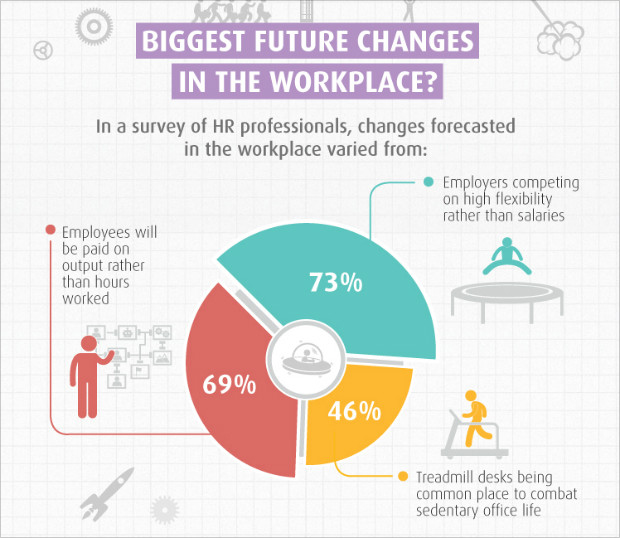
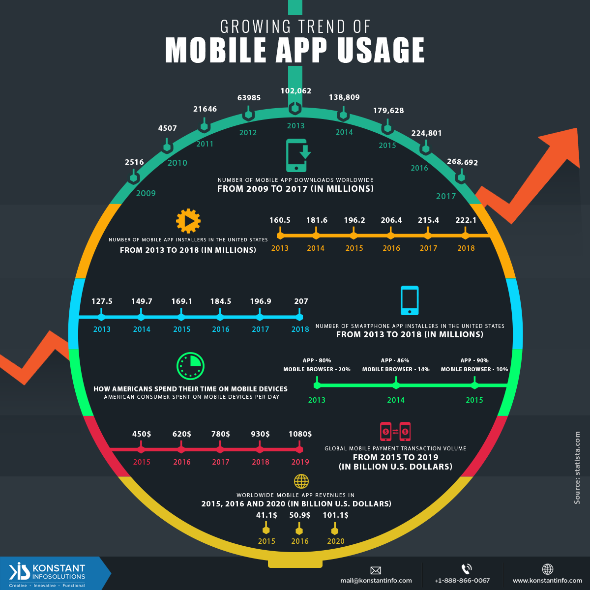

#Students Name: Sriram Sai Sumanth
#GNumber:G-01230629

# Assignment 11 Task1

## Question 1: Find one example of distortion or unnecessary detail in a visualization, explain the problem and suggest a solution [1]

## Distorted Graph: 

## problems in the distorted graph
In the graph the images like a man jumping and running on a threadmill is not required making it a distorted graph.
In the pie chart all the values must sum upto 100 but the values showcased in the visualization sum up to 188.
##  Solution
To overcome this problem, i thought of using a bar graph with employee changes on x-axis and their corresponding numerical percentage on the y-axis, and using different colors for different changes so that it is easy to distinguish and provide a proper legend.

## Question2 : Find one example of misleading interpretation, explain the problem and suggest a solution 

## Misleading graph[2]

 The misleading graph was taken from Konstant Infosolutions website.This website states that the usage of applications in the mobile phone have increased from 2015 to 2019.

##  Mislead
•	This visualization contains plethora amounts of data which is very chaotic.
•	It contains very distracting features and chart junk such as usage of dark colors, unwanted pictorial representations.
•	The labeling of the data is very small making it hard to read.
•	There are no proper graph representations showing the growth patterns as quoted in the title.
•	Missing values in the data leading to inaccurate conclusions.
•	Estimating differences between different aspects of the data is a tough task.
•	Understanding the data takes more time.

## solution
I though of creating different graphs for different aspects of data,
### Graph1:
I thought of using a line graph for mobile application downloads from 2009 to 2017(in millions) as it is an ordered variable.The x-axis represents the years and y-axis represents number of downloads count. we can use a color to represent the incresing number of downloads year  by year with incresing color intensity ,With highest number of downloads in 2017 and lowest in 2009.

### Graph2:
I thought of representing mobile and smartphone application downloads  in US (in millions) between 2013-2018 in a single line graph With years on x-axis and number of downloads on y-axis and by drawing two lines with different colors for these two trends so that one can easily differentiate and compare number of mobile and samrt phone application downloads year by year. I thought of labeling the values neatly and also included the legend. So one can easily infer and tell which application installers are more every year.

### Graph3:
I thought of using a stacked histogram to show the time spent by Americans on mobile devices (in percent) from 2013-2015 beacuse it is in percentage and best way to represent the total percentage is by using a stacked histogram. Stacked bar graphs are used here because, they can clearly represent sub-categories in mobile devices i.e. apps and mobile browser. It is clear that usage of mobile browser decreases by time and usage of mobile apps increases. Usage of mobile apps take over browser by 90% in 2015. Proper legend and color representation is given to the graph.

### Graph4:
I thought of using a line graph for the global mobile payment transaction (in billions) from 2015-2019. With year in x-axis and transactions in billions on y-axis. Line graph is used here because it is an ordered variable and the increase in the total amount spent can be plotted clearly. We can easily observe the trend once plotted and can tell whether it is incresing linearly or abnormally.

### Graph5 :
I thought of using a line graph for  the worldwide mobile app revenue (in billions) in 2015, 2016 and 2020. I thought of using a line graph because it is a ordered variable  year on x-axis and revenue on y-axis. It is predicted that the mobile app revenue will double its value from 2015 to 2020 with $101.9 billion.

### Dashboard:
I thought of using a dashboard beacuse it is used to represent all the visualizations in a consolidated display. So it is easy to compare and monitor variety of data simultaneously rather representing all data in a single visualization making it difficult to understand. Hence one can easily tell that the mobile application usage is increasing year by year by looking at the dashboard.

### References:
[1]N.chibana,"Visme's learning enter,"[online]. Available: https://visme.co/blog/bad- infographics/. [Accessed 26 October 2019].

[2]Nawal, Udita.”Micrographic – Growing Trends of Mobile App Usage.” Konstantinfo, Konstant Infosolutions,31 mar 2016, Available: https://www.konstantinfo.com/blog/micrographic-growing-trends-mobile-app-usage/

